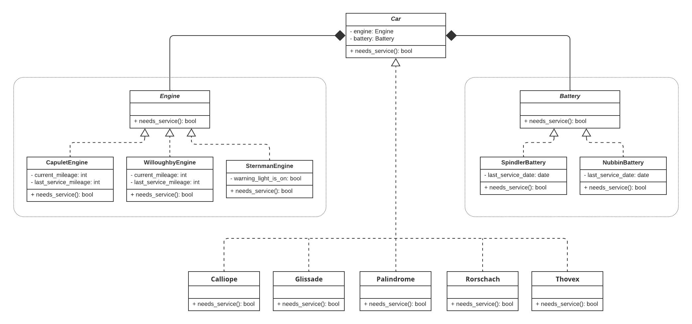

# Lyft Back-End Engineering Virtual Experience Program

### Description

"Lyft Back-End Engineering Virtual Experience Program" programming project by Forage. The topics seen in the realization of this project are: Software Architecture, Refactoring, Unit Testing and Test-Driven Development.

### UML Diagram

